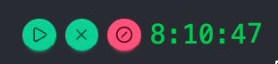
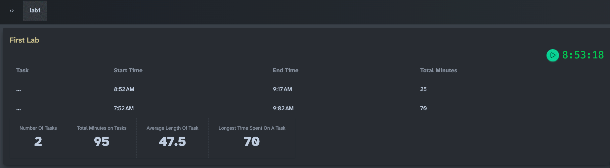

# Applied Angular - Lab 1

> If You are Doing This Again, Create a new Area and Use the Scaffold In the New Area - e.g. Lab 2

## Scaffold a New Area

You will create a new area and feature for this lab.

1. In VS Code, right click on the `/src/app/areas` folder and select "New Folder". Name the folder `labs`.
2. Using the NPM SCRIPTS section at the bottom of the Explorer view in VS Code, find the `scaffold` command and hit the "play" button.
3. In the terminal window, enter the number associated with the newly create "labs" area and hit enter.
4. When asked "Enter the name of the feature:", enter "lab1" and hit enter.
   1. This will scaffold the area with routes, create a default page, and add the route to your app.ts.
5. Add an icon for the link we will create next.
   1. Find the file `src/app/areas/shared/ui-common/icons/types.ts`
      1. Hint: Hit `Ctrl+P` and type `types` and select it from the list.
   2. Add the icon `lucideFlaskConical` to the imports, and the exported list of icons.
6. Add the link.
   1. Open `/src/app/app.ts` and add a new link the the array of links in the component class.
      1. The path should be `/lab1`.
      2. The title should be `Lab 1`
      3. The icon should be `lucideFlaskConical`
7. Open your app in the browser, check that the link for Lab 1 exists on the left navigation bar and works properly.

## Warm Up Round: Create A Clock

Using the DaisyUi [Clock Countdown](https://daisyui.com/components/countdown/#clock-countdown), display a clock on the top right of the `/src/app/areas/lab1-landing/internal/pages/home.ts` component.

- It should start by displaying the current time (hours, minutes, second).
- It should be displayed in the top right of the page.
- Using signals, have it update the time using the current time every ~1s.

### Hints

- To shift it to the right, wrap it in a `
`
- Add the class `ml-auto` on the first nested `` in that div.
- Create a `signal` on the component that can hold the current hour, minutes and seconds.
- Use an `effect` in the constructor.
- Too see my solution [Look Here](./code/warm-up.md)

## Extract the Clock To It's Own Component

1. Highlight _just_ the entire span for the clock (e.g. ` ... `) and cut it (Ctrl+X).
2. In the `/areas/labs/lab1-landing/internal` folder, create a new folder called `widgets` and in that folder a file called `clock.ts`.
3. In the `clock.ts` file, type `ngrc` and hit tab to use the refactor component snippet.
4. The selector should be `app-labs-lab1-clock`.
5. Move the relevant code from the `home.ts` to fix the build errors in this new component.
6. Notice that the clock no longer is displayed on the top right.
   1. See if you can fix that.

### Hints

- The CSS Issue: There are many ways to fix this. The simplest I found was to move the class `ml-auto` from the root `` on the component to a `host` binding on the component.
- To see my code [Look Here](./code/extract-component.md)

## Make the Clock A Task Timer

1. Add three new icons to `src/app/areas/shared/ui-common/icons/types.ts`
   1. `lucidePlay`
   2. `lucideX`
   3. `lucideCircleSlash`
2. In the `clock.ts` component, use these to create three buttons next to the clock.
   1. A "start" button with the icon `lucidePlay`
   2. A "cancel" button with the icon `lucideCircleSlash`
   3. A "done" button with the icon `lucideX`

Mine looks like this:

### Hints

- [Here's Mine ](./code/task-timer-1.md)

### Buttons as State Machine

1. By default only the "start" button with the play icon should be displayed.
2. When the play icon is clicked, the cancel and done buttons should be displayed.
3. If either the cancel or done buttons are clicked, they disappear, and the play button reappears.
4. (Bonus) if we are recording a task (the play button is selected), animate the clock portion with a TailwindCss `animate-pulse` animation.

## Using An Output

### Using an Output

If (and only if) the user hits the play button, then hits the done button, emit an output to the parent called `taskAccomplished` with:

- The time the task was began
- The time the task was completed

### Parent (home.ts) Displays Summary

The parent component (`home.ts`) should display a list of all the tasks that have been completed during that session, and calculate the number of minutes taken for each task, and total number of minutes for all tasks.

### Parent (home.ts) Displays Statistics

The parent component (`home.ts`) should display some summary information about the tasks:

- Total Number of Tasks
- Total Minutes spent on all tasks
- Average time spent on tasks
- The longest time spent on any one task

### Hints

- Clock
  - You will need to record the time in a signal when they begin a task.
  - You will need to define an output that can contain the data to supply to the parent.
- Home
  - Consider using a DaisyUI Table.
  - Going to need a couple of `computed` fields, probably.
  - Use Angular's `DatePipe` to format dates and times.

Here's Mine:

To see my final code:

[Final Code](./code/final-clock.md)
